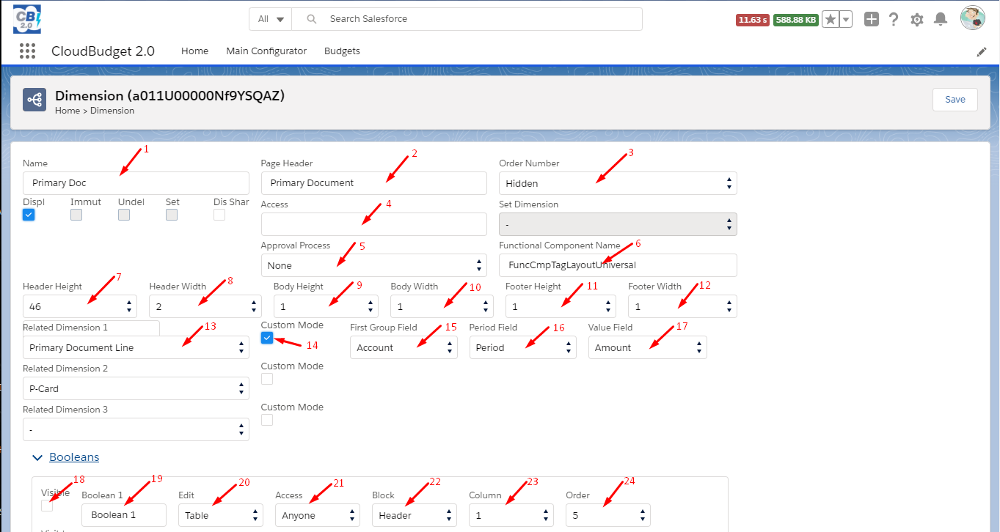
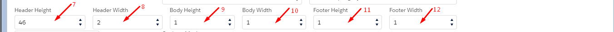
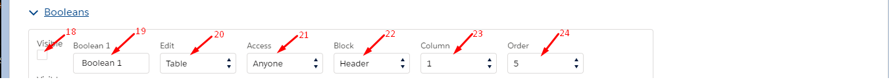

<html>
<body>

<head>
    <meta charset="UTF-8">
    <title>Budget App</title>
</head>

<h1>Dimensions</h1>

To configure view of the Primary Document go to its Dimension. 
To customize view of the Primary Document, set up next fields: 
1. Name - The name of Primary Document: 
2. Page Header - The public name of Primary Document that will be displayed on the view page, in the list view etc.; 
3. Order Number - ? ; 
4. Access - Tags of sharing user groups; 
5. Approval Process - Aproval Process for Primary Document; 
6. Functional Component Name - API Name of the custom component that will be used on the Primary Document View; 
13. Related Dimension - Choose related to the Primary Document items, for displaying in related lists on the view page; 
14. Custom Mode - If "false", work as standart list view. If "true", group items by Periods; 
15. First Group Field - Choose field to group related items in Custom Mode; 
16. Period Field - Choose field of the related item in wich Period is stored; 
17. Value Field - Choose amount field, that will be shown in the Custom Mode view; 

 
To customize UI of the Primary Document there are 6 fields. 
Logicaly view page consist of three blocks: "Header", "Body", "Footer". 
<table width="300px">
	<tbody>
		<tr style="border: 2px solid white;"><td align="center">Header</td></tr>
		<tr style="border: 2px solid white;"><td align="center">Body</td></tr>
		<tr style="border: 2px solid white;"><td align="center">Footer</td></tr>
	</tbody>
</table>
Each block has 1 - 3 columns. 
<table border="1" width="400px">
	<tbody>
		<tr><td colspan="3" style="border: 2px solid white;" align="center">Header Width = 1</td></tr>
		<tr>
			<td colspan="3" style="border: 2px solid white;" align="center">
				

				
Body Width = 2

				
Body Width = 2

				

			</td>			
		</tr>
		<tr>
			<td style="border: 2px solid white;" align="center">
				

					
Footer Width = 3

					
Footer Width = 3

					
Footer Width = 3

				

			</td>
		</tr>
	</tbody>
</table>
7. Header Height - number of fields in the header columns; 
8. Header Width - number of columns in the header block (1-3); 
9. Body Height - number of fields in the body columns; 
10. Body Width - nember of columns in the body block (1-3); 
11. Footer Height - number of fields in the footer columns; 
12. Footer Width - nember of columns in the footer block (1-3); 

 
Each field has its own settings: 
18. Visible - If "true" field will be displayed on the view page; 
19. Title field - Name that will be used as label for concrete field on the view page; 
20. Edit - Where this field must be shown. "Card" - table and card; "Table" - only table; 
21. Access - User or group that have access to the field; 
22. Block - Block where to show this field (Header, Body, Footer); 
23. Column - Column where to show this field (1 - 3); 
24. Order - Order Number, position where to show this field inside the column (vertical align); 

 
<h4>Exception description:</h4>
<table style="width: 100%">
	<tr>
		<th>Exception</th>
		<th>Description</th>
	</tr>
	<tr>
		<td>EXCEPTION: </td>
		<td> </td>
	</tr>
</table>

 

    Navigate to:
   

<a href="https://cloudbudgetinc.github.io/Docs/CBCore">Main Page</a>

<button onclick="topFunction()" id="myBtn" title="Go to top">Top</button>

</body>
</html>
