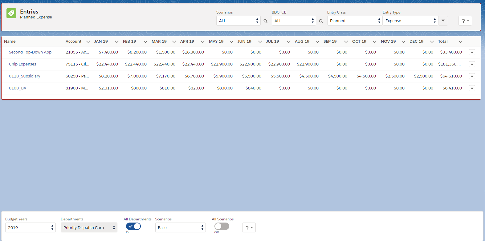
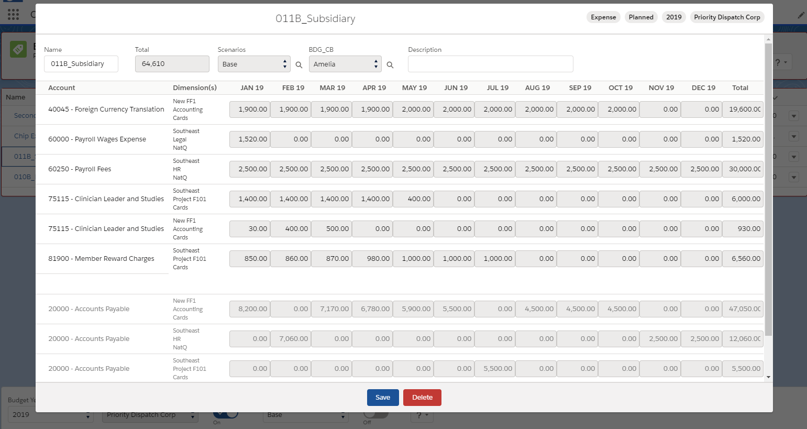

<html>
<head>
    <meta charset="UTF-8">
    <title>Entries</title>
</head>

<body>
<h1>Entries</h1>

    
A journal entry, in accounting, is the logging of a transaction in an accounting journal that shows 
    a company's debit and credit balances. The journal entry can consist of several recordings, 
    each of which is either a debit or a credit. 
    The total of the debits must equal the total of the credits or the journal entry is considered unbalanced.</>

 
<h3>List of Entries</h3>

The entries list contains transactions of the posted primary documents that. 
The list can be filtered by year, department, demention and other necessary analysts.

 
<h3>Entre View</h3>

Each entry displays information about the type of entry, accounts, dimensions (if they exist) 
and a link to the source Primary Doc

There are several types of entries

<ul>
    <li>Planned</li>
    <li>Actual</li>
    <li>Wage</li>
 </ul>

<h4>Exception description:</h4>
<table style="width: 100%">
	<tr>
		<th>Exception</th>
		<th>Description</th>
	</tr>
	<tr>
		<td>EXCEPTION: There are no properly period in current BY</td>
		<td>The entry date that you selected does not belong to the current year. Please select another date or change BY </td>
	</tr>
	
</table>

 

    Navigate to:
    
<a href="https://cloudbudgetinc.github.io/Docs/CBCore">CB Base Documentation</a>

    
</body>
</html>