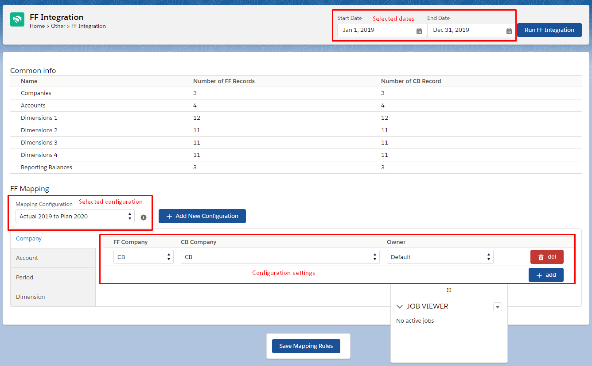

<html>
<body>

<head>
    <meta charset="UTF-8">
    <title>FF Integration</title>
</head>

<h1 id='pageTop'>FF Integration</h1>

    
FF Integration allows to import FF Reporting Balances to CloudBudget side using specific congifuration of the
        mapping.
    

    <ul>
        <li><a href="FFIntegration.html#config">Setup a Configuration</a></li>
        <li><a href="FFIntegration.html#run">Run Import</a></li>
        <li><a href="FFIntegration.html#features">Features</a></li>
    </ul>

    
You can find additional information for each item below.

     
    <h3 id='config'>Setup a Configuration</h3>

    
Text

    

     
    <h3 id='run'>Run Import</h3>
    
Text

     
    <h3 id='features'>Features</h3>
    
The integration algorithm is as follows:

    
1. Batch deletes previous imported records based on selected dates and the mapping configuration

    
2. The controller checks whether all the necessary analysts are present on the CloudBudget side (Accounts,
        Dimensions, Locations, etc)

    
3. Batch creates a list of new Records of CB Reporting Balances, based on FF Reporting Balances,
        selected dates and the current configuration settings

     

     
    

    

        Navigate to:
        
<a href="https://fallentol.github.io/CloudBudget/CB2/CBCore">CB Base Documentation</a>

    

    <button onclick="topFunction()" id="myBtn" title="Go to top">Top</button>

    

    

</body>
</html>