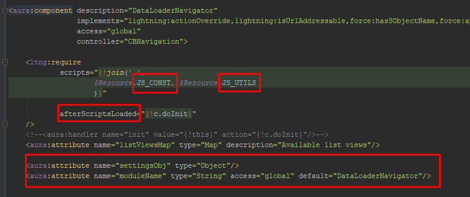
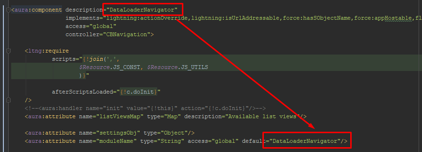
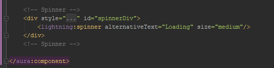
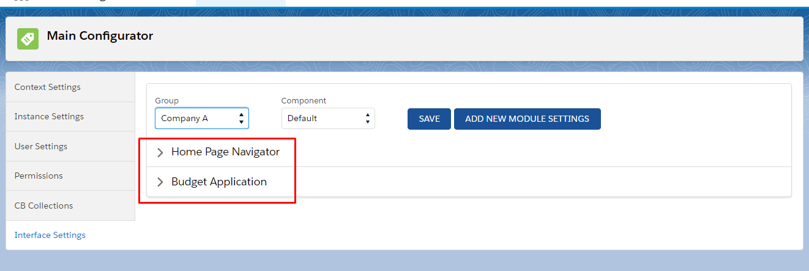
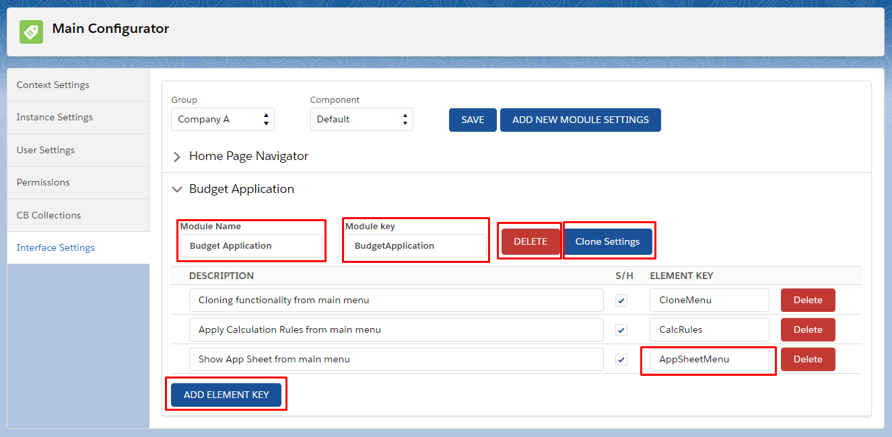
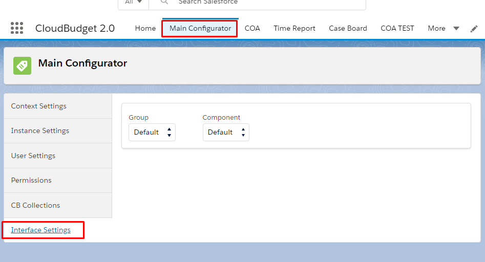

<html>
<body>

<h2>Instructions for configuring the component interface</h2>
<ol>
    <li>The component must have _JS_CONST _and _JS_UTILS _libraries connected. </li>
<li>the _doInit _function should be run from the _afterScriptsLoaded _attribute instead of the handler.</li>
<li>If the server controller is not used, you need to connect _CBPermission_.

</li>
<li>The component must have the following attributes:
     
    <code>
    <aura:attribute name="settingsObj" type="Object"/>
    <aura:attribute name="moduleName" type="String" access="global" default="yourComponentName"/>
    </code>
     
   In the _moduleName_ attribute, enter the name of the component by default, the attribute must have global access.
   
   
   
</li>
<li>The interface elements that we want to hide must be wrapped in an element that supports the class attribute.</li>
<li>In the class attribute you need to write the following:
     
    <code>    
    class="{!v.settingsObj.YourUniqueKey == null ? 'slds-hide' : v.settingsObj.YourUniqueKey}"
    </code>
      
   where _v.settingsObj_ is a link to the page variable that stores the object with the settings, _YourUniqueKey_ is a unique key (it is desirable that it be meaningful, indicate the nature of the content being wrapped), which is also the key of the field in which the desired class is located (empty or _slds-hide_). The above expression, in the absence of an appropriate field for the object, leaves the default _slds-hide_. Thus, you can wrap the necessary elements with such classes with unique keys, and then configure them if necessary in a special component. If you want to make sure that by default, in the absence of settings, the element is visible, you must write the class like this:
   
     
    <code> 
    class="{!v.settingsObj.YourUniqueKey}"
    </code>
     
</li>
<li>Add the following to the _doInit_ function on the page controller:
     
     <code> 
        _getCurrentUserSettings(cmp);
     </code>
     
   There are three functions in the _JS_UTILS _library called by this command.
   The first function pulls the _CBTag__c _list with the settings corresponding to the current user, the second merges them into one option (since the user can belong to different groups, we must show him the maximum interface allowed to him personally), and the last function forms an object with settings, which is written to page variable _v.settingsObj_.
    
</li>
<li>If you need a waiting spinner, add it like this:
     
    <code> 
    <!-- Spinner -->
    
    

    
       <lightning:spinner alternativeText="Loading" size="medium"/>
    
    

    
    <!-- Spinner -->
    </code>  
     

 
</li>
<li>When using this component as part of another component, it is necessary to specify the name of the top component in the _moduleName _attribute, then it will be possible to collect the settings for all components included in its composition in one place - in the settings of the main component. It will also allow you to define for one user group different settings for the current component, depending on where it is used as a child.
    
   In case of initialization of the component from the markup:
   
     
    <code>
    <c:YourComponent moduleName="YourModuleName"/>
    </code>
     
   where in the _moduleName_ attribute lies the name of the parent component.
    
   In the case of dynamic initialization (example of a function that creates a dynamic component):
    
     
    <code>
    handleSelect: function (cmp, event, helper) {
    
       let selected = event.getParam('name');
    
       let componentNamePlus = 'c:' + selected;
    
       try {
    
           $A.createComponent(componentNamePlus,
    
               {
    
                   "aura:id": selected,
    
                   "moduleName": "**YourModuleName**",
    
               },
    
               function (compo, status, errorMessage) {
    
                   if (status === "SUCCESS") {
    
                       let body = [];
    
                       body.push(compo);
    
                       cmp.set("v.body", body);
    
                   } else if (status === "INCOMPLETE") {
    

    
                   } else if (status === "ERROR") {
    

   
                       _CBMessages.fireErrorMessage("Component loading error");
    
                   }
    
               }
    
           );
    
       } catch (e) {
    
           console.error(e);
    
       }
    
    },
    </code>
     
   In this case, we indicate the name of the parent component here:
    
     
    <code>
    $A.createComponent(componentNamePlus,
               {
    
                   "aura:id": selected,
    
                   "moduleName": "YourModuleName",
    
               },
    </code>
     
    
</li>
<li>In the server controller class, if it is not _CBPermission_, the following method must be added:
    
     
    <code>
    @AuraEnabled
    
    public static List<String> getCurrentUserInterfaceSettingsListServer(String componentName) {
    
       return CBPermission.getCurrentUserInterfaceSettingsListServer(componentName);
    
    }
    </code>
     
</li>
<li>To add settings, you need to open the _interface settings_ tab in the _main configurator_.

</li>
<li>In the Group drop-down menu, select the group for which you are configuring. In the future, settings for one group can be copied to other groups.</li>
<li>A list of settings for various modules appears, if any.</li>

<li>Expand the accordion with the desired component:
   
   
   
   In field 1 is an arbitrary name of the component that is convenient to read, in field 2 is the name of the module or an individual component for which these settings are applied. Settings can be deleted (3) and cloned (4). You can add a new line (5), in which you need to enter in the field 6 that unique key that is mentioned in step 6. After saving the settings by the checkbox, you can switch the visibility of this interface element for the current group of users. After the initial configuration of all the interface elements of the module, it’s convenient to simply copy the settings between groups.
   It is also recommended that in the Description field of each setting, if it is not in the head component (module), indicate the path by which it can be found, for example, like this:
    
     
     <code>
      BranchNavigator => Posting Rules => Posting Rule Configurator
     </code>
      
  </li>
</ol>

 

    Navigate to:
    
<a href="https://cloudbudgetinc.github.io/Docs/CBCore">CB Base Documentation</a>

 
</body>
</html>