<html>
  <body>
<h2>1.Import FinancialForce Reporting Balances</h2>

1.1 Go to the CB Start page, then click “Import FF Actual RB” in the budgeting section

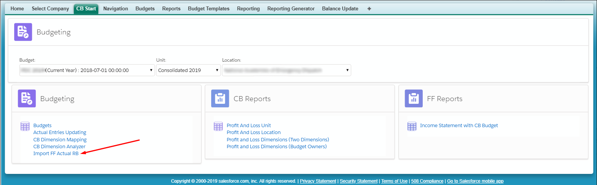 

From the current page select the Reporting Balances and Periods. Next click “Clean up selected period and Import”.

1.2 Select the import type for the reporting balance import

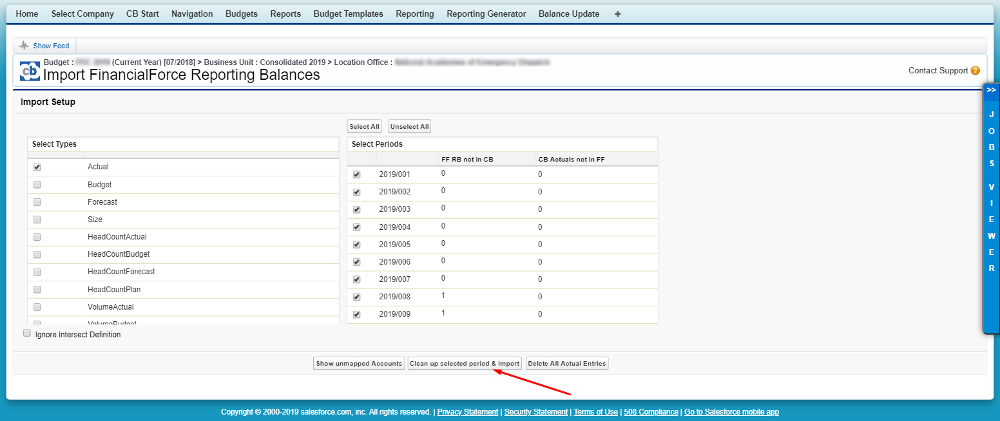

The outdated imported entries will now be cleaned up for the selected periods and new entries will be created based on the up-to-date Reporting Balances.
Wait until the jobs viewer shows that the batch job is complete.

1.3 Next you need to update the dimension mapping. To do this go to the CB Start page and click “CB Dimension Mapping” in the Budget section.

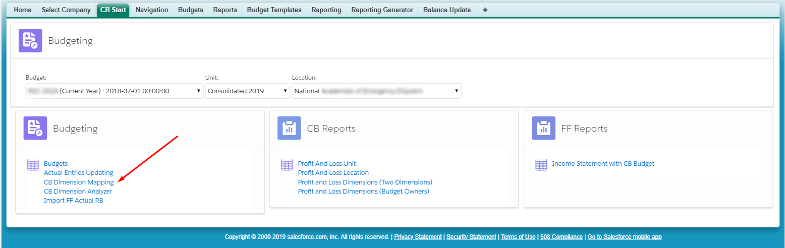

Click the “Update CB entries” button

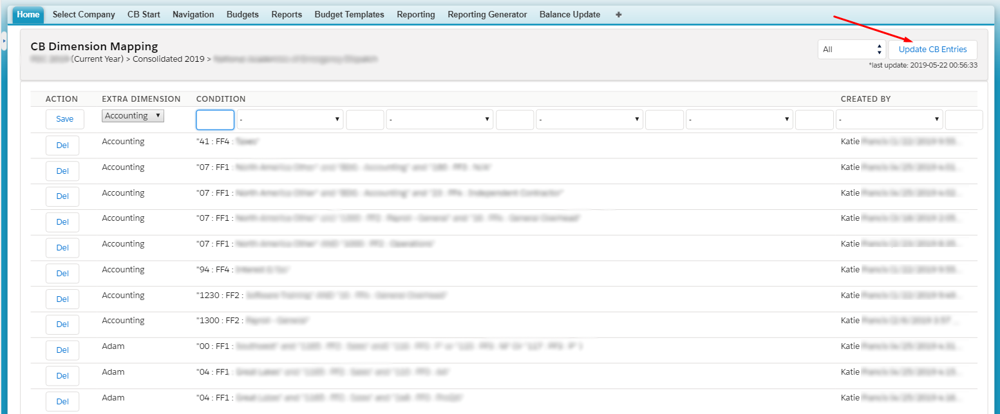 


<h2>2. Mapping FinancialForce and CloudBudget Accounts</h2>
<em>NOTE: You need to perform this mapping only when / if you have some FF GL accounts meaningful for Budgets & comparison, and unmapped to respective CB accounts. For current FY & FY 2020 CB does not recommend to have BS accounts mapped. PL is enough.</em>

Mapping is required for the correct import of both FinancialForce and CloudBudget accounts.

2.1 To see the accounts that are not yet mapped, go to the CB Start page, then in the Budgeting section click “Import FF Actual RB”

2.2 Click the “Show unmapped Accounts” button

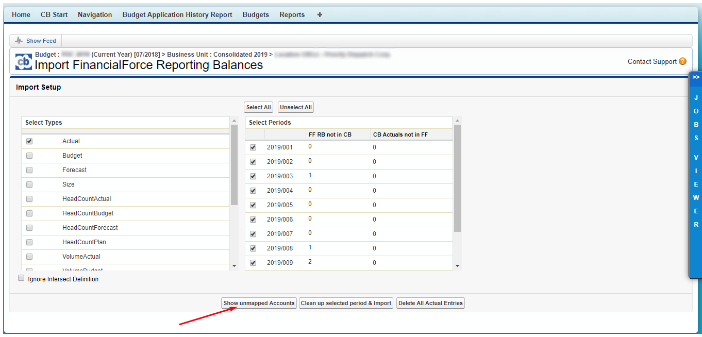

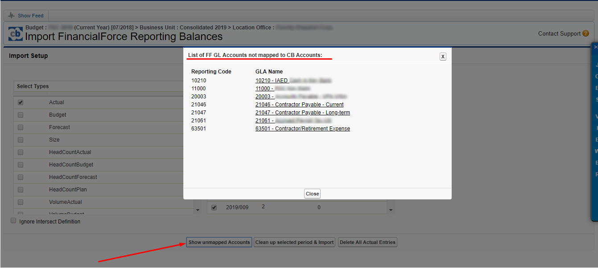

2.3 Click on the first unmapped Account. A new window opens with the account details

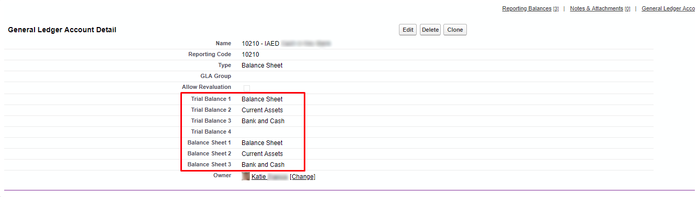

2.4 Once you know the account details you need to add a similar account in CloudBudget and map it to this FinancialForce account. To do this go to the Navigation page, and click “Chart of Accounts” under the Consolidated Entity (Unit) section

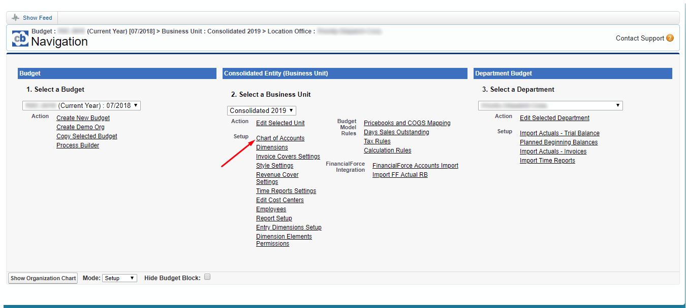

2.5 As the account is an asset, add it to assets, select the relevant subtype, and click "Add"

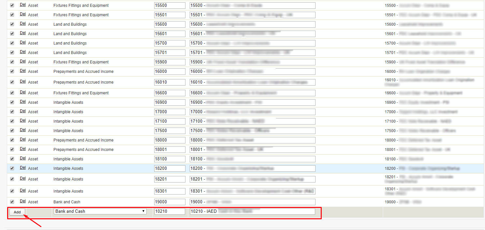

After adding the account it will appear in the Chart of Accounts table according to its type. In this case the type is “Asset”.

2.6 Now double-click "--None--"  in the "FF Account" column

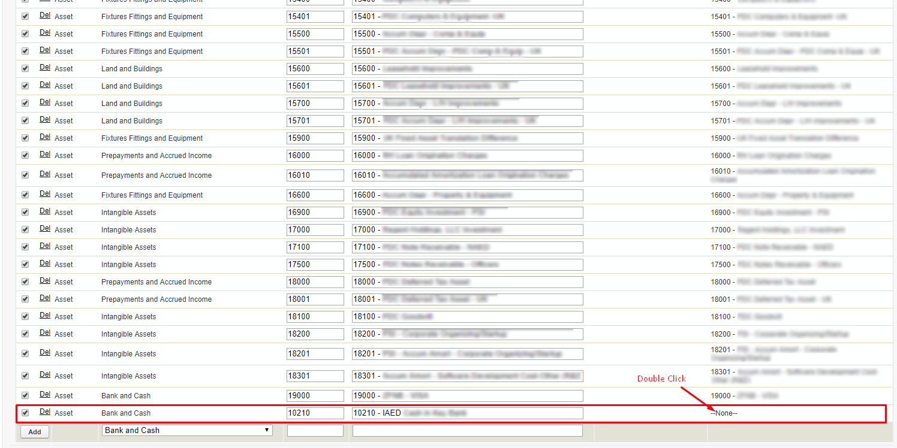

From the drop-down menu that opens, choose the general ledger account (GLA) that you want to map to the CloudBudget account just created

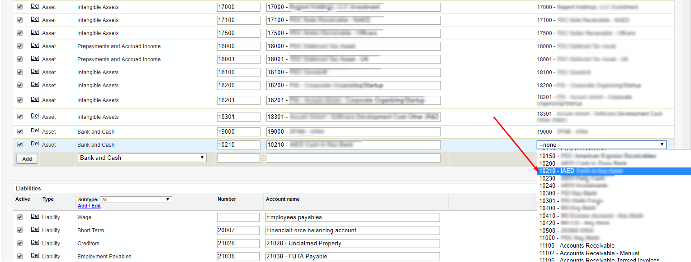

Click "Save"

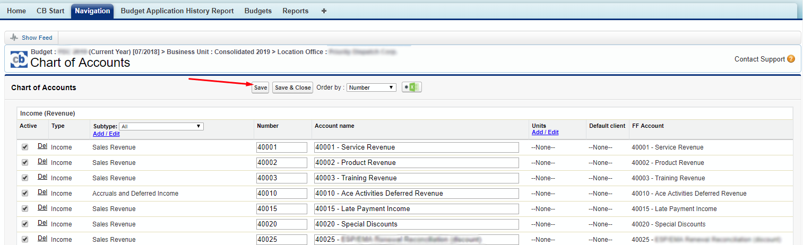

2.7 To confirm the mapping was successful, let`s take a look at the account

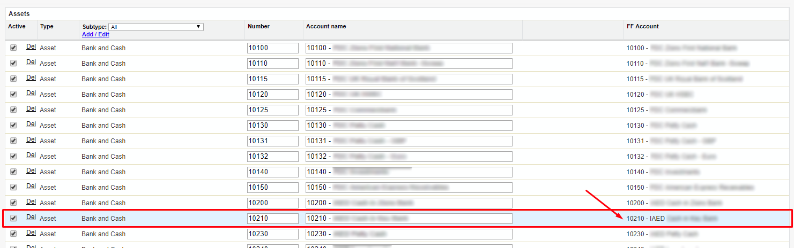

The "FF Account" column now contains the GLA that we have just mapped.

2.8 Next, from the Navigation page, in Setup mode, choose the department to which you want to use this account. In this case this is "Priority Dispatch Corp.”  Click “Edit Selected Department”

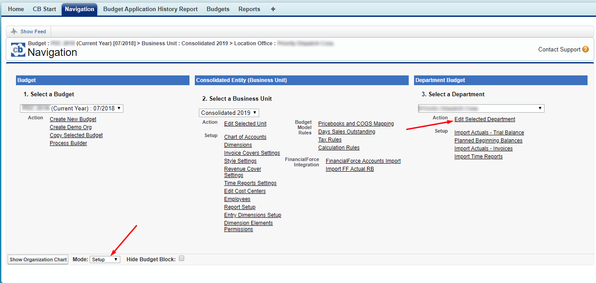

2.9 Click on the “Chart of Accounts” in the new window

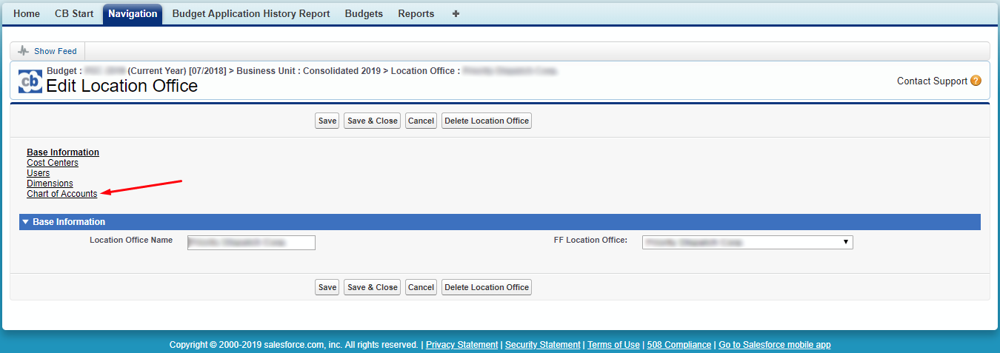

Here you will see a list of CloudBudget accounts that can be used in the selected department

2.10 Find the newly added account in the list and check the appropriate box. You may check it all if applicable. Click the "Save"

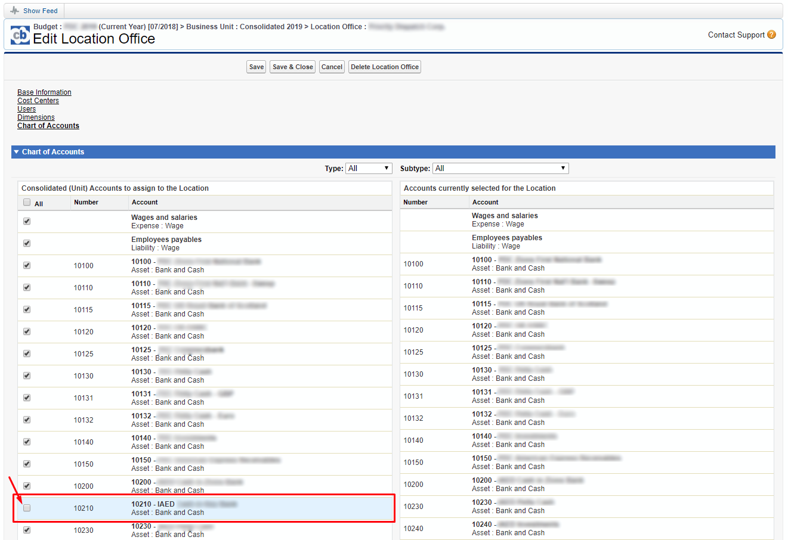

Now the account is mapped.

2.11 To confirm the account is mapped look at the accounts that are unmapped. Go to the CB Start page and click the “Import FF Actual RB” link in the Budgeting section.

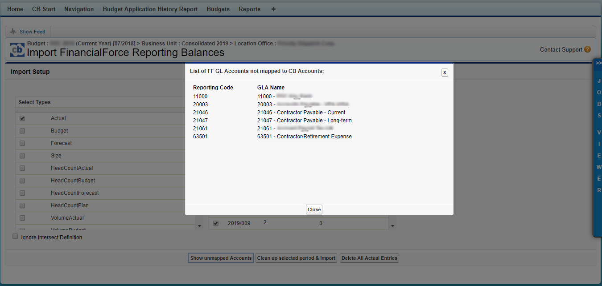

2.12 After all the accounts in the GLA are mapped you need to re-import all periods, or all those where FinancialForce RBs are not yet in CloudBudget

 

2.13 Wait until the batches complete, then map the dimensions

 </body>
</html>

