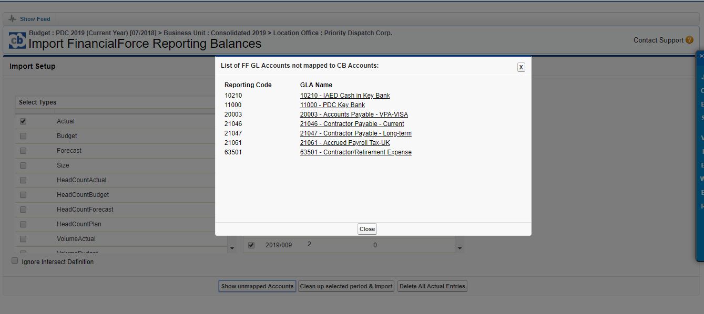

<html>
	<body>
	<h2>IMPORT AND MAPPING DATA</h2>

	<ul>
	    <li><a href="#top">Non-zero FF not in CB</a></li>
	    <li><a href="#report">Report Issues</a></li>
	</ul>

	

 
	
1. Reasons for non-zero FF not in CB:

	<ul>
		<li>FF GLAs are not mapped to CB accounts (CB does not import data from RBs with GLAs not mapped to CB budget accounts). You need to follow steps 1.1 - 1.6 to clean this up</li>
		<li>Just new FF RBs appeared you need to follow step 1.6 to clean this up</li>
	</ul>

	
	
You can now check all GLAs not mapped to CB Budget accounts in RB import page in CB

	

	
Upon clicking you will se something like this 

	
	

	
You may map them (if needed only - not sure you need all BS GL accounts to be mapped) in CB Chart of Accounts: 

	
1.1 Follow Chart of Accounts link from Navigation 

	

	
1.2 Add new account in respective part of CB GLs, select needed subtype, press Add

	

	
1.3 After the CB account has been added you can map it to FF account. Double click to None 

	

	
, select FF GLA to be mapped to newly created CB account. Sample - 10210 - IAED Cash in Key Bank.

	

	
Click save "Save" 

	

	
Now you see in "FF Account” the mapped GL accost 

	

	
NOTE Before creating new CB budget account & mapping it ti FF GL Account - think if you really need this. For PL accounts - for sure yes. For BS accounts - our advice would be “No” or “Not in this & coming budget years"

	
1.4 Add permissions in CB

	
In Setup mode in Navigation, click Edit Selected Department - for the company, you need to allow this new CB account.

	
In this sample it is "Priority Dispatch Corp."

	

	
Follow "Chart of Accounts" 

		

	
 On the left side you see all accounts, on the right side - allowed for the company. To allow the new account - tick it on the left side or select all. Press Save

	

	
1.5 To double check it works check the list on unmapped FF GL accounts in  FF Actuals import page in CB. In the sample you do not see this GL account any more

	

	
1.6 After you mapped all needed FF GL accounts - re-import all periods, or the ones where you see non-zero in "FF RB not in CB" 

	

	
Just wait till batch will be completed :slightly_smiling_face: and refresh dimension elements in CB entries

	
	
	

	

 

	</body>
</html>