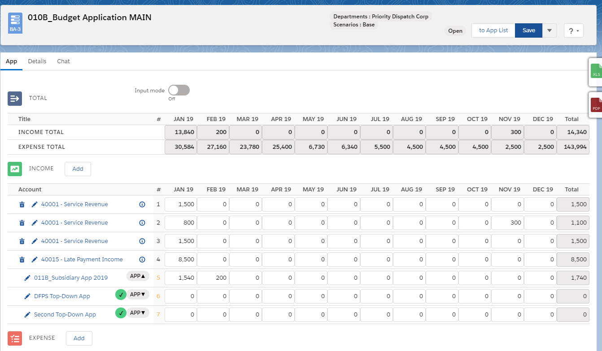
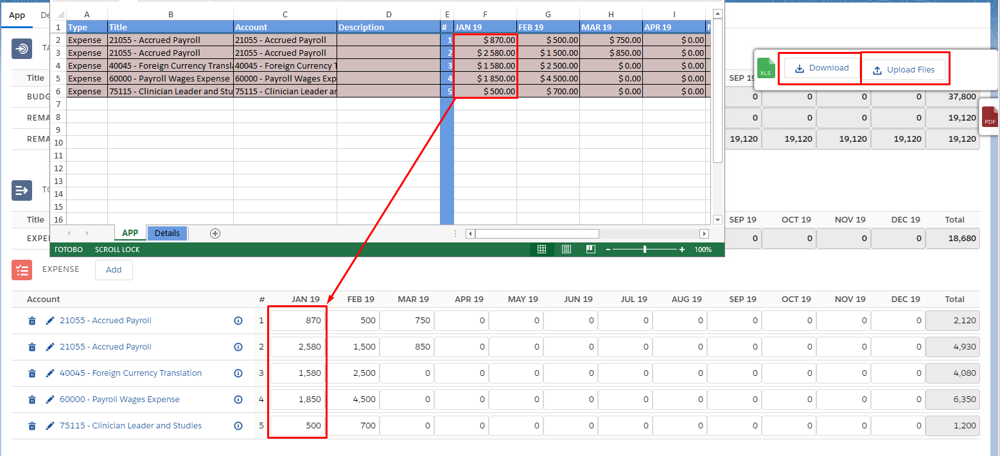
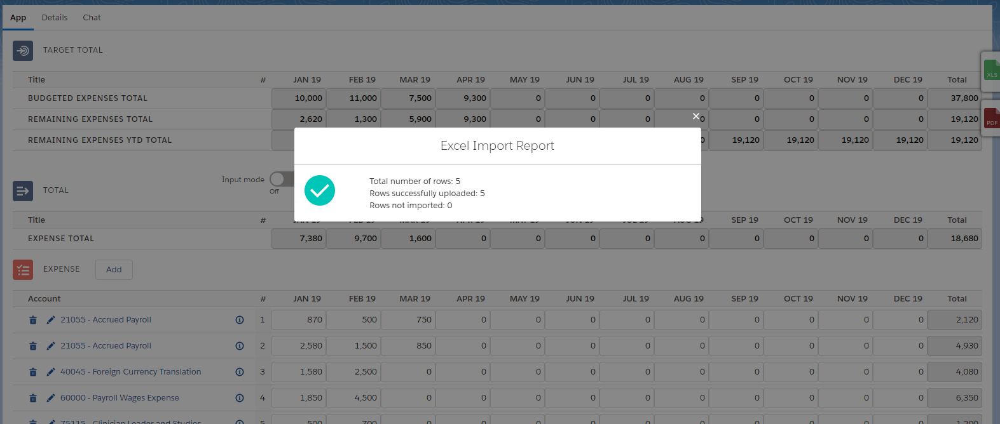

<html>
<body>

<head>
    <meta charset="UTF-8">
    <title>CloudBudget2.0 Release Note</title>
</head>

<h1 id='pageTop'>CloudBudget2.0 Summer 2020 Release Note</h1>

    
List of Summer 2020 additives

    <ul>
        <li><a href="ReleaseNote.html#budgetApp">Budget Application</a></li>
        <li><a href="ReleaseNote.html#budgetAppSheet">Budget App Sheet</a></li>
        <li><a href="ReleaseNote.html#googleDrive">Google Drive</a></li>
        <li><a href="ReleaseNote.html#PostingRules">Posting Rules</a></li>
        <li><a href="ReleaseNote.html#CBalances">CBalances</a></li>
        <li><a href="ReleaseNote.html#additional">CB Reports</a></li>
        <li><a href="ReleaseNote.html#additional">Report Configurator</a></li>
        <li>FF Integration</li>
        <li>Other</li>
    </ul>
    
You can find additional information for each item below.

     
    <h3 id='budgetApp'>Budget Application</h3>
     - Budget Application allows enter amounts into transaction lines much conveniently

    
The main application can have several child applications,
        each of which can have its own child items, etc.
        The structure is presented in a convenient form on the table (see screen).
        Table filters allow you to see only a list of required applications.

    

     
    <h3 id='appView'>App view</h3>
    
Typically, an app consists of one section (inc or exp),
        but you can also use them simultaneously

    

     
    <h3 id='topDown'>Top-down approach</h3>

     
    <h3>Bottom-up approach</h3>

     
    <h3 id='sharing'>Sharing rules</h3>

     
    <h3 id='excel'>Excel export/import</h3>
    
App allows you to upload data to an Excel file.
        Data in excel file can be changed. You can add or remove lines.
        It is important to keep the file format, otherwise the file cannot be imported back

    
    
After the data is downloaded back, you will receive a message about the successful download
        or import errors

    

     
    <h3 id='additional'>Additional Features</h3>
    <ul>
        <li>An App cannot be "Posted" until all its subsidiary apps are not "Posted"</li>
        <li>Clone</li>
        <li>Interface Permissions</li>
    </ul>

 

 

    Navigate to:
    
<a href="https://cloudbudgetinc.github.io/Docs/CBCore">CB Base Documentation</a>

    
<a href="https://cloudbudgetinc.github.io/Docs/BudgetTemplate">Budget App Template</a>

<button onclick="topFunction()" id="myBtn" title="Go to top">Top</button>

</body>
</html>