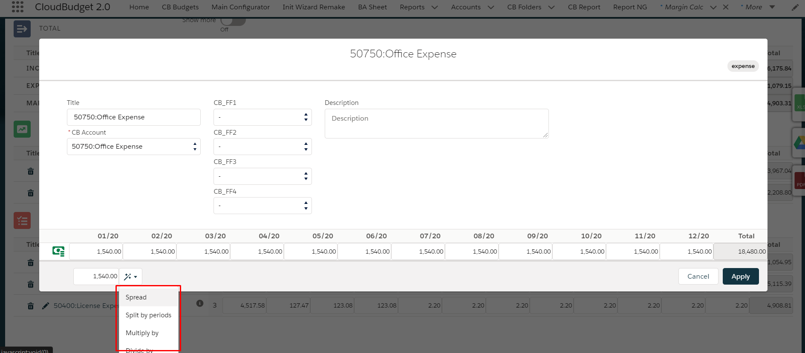
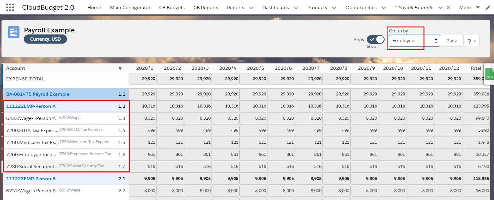
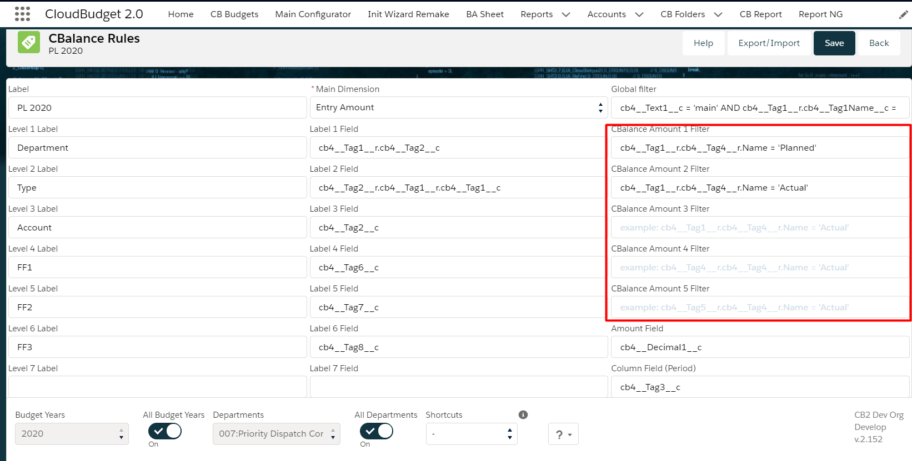
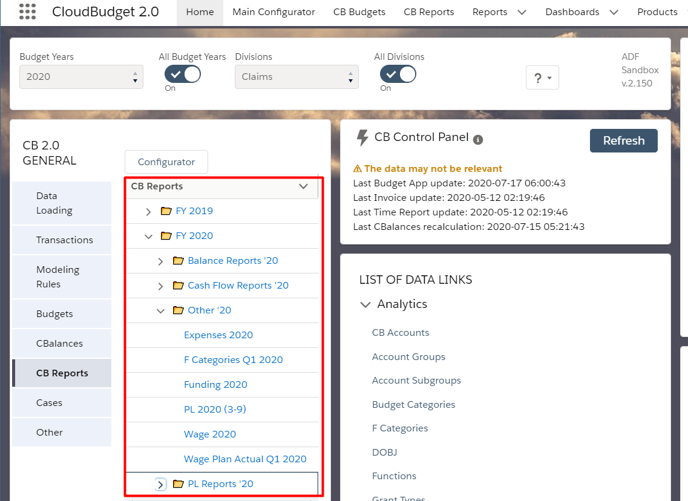
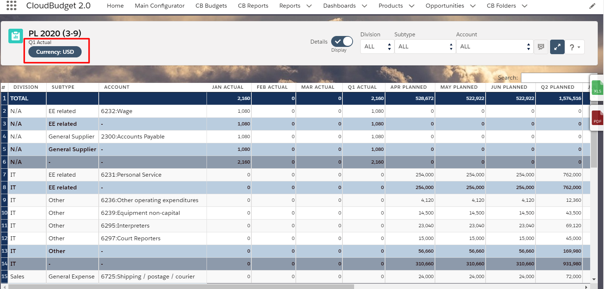
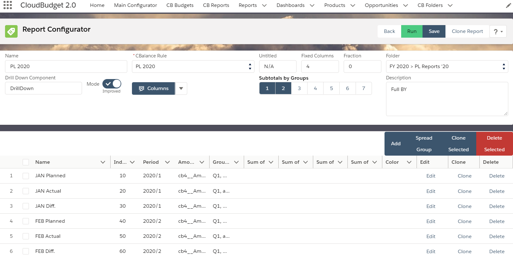
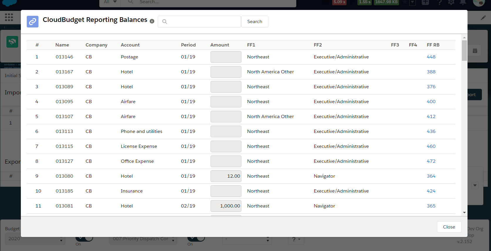
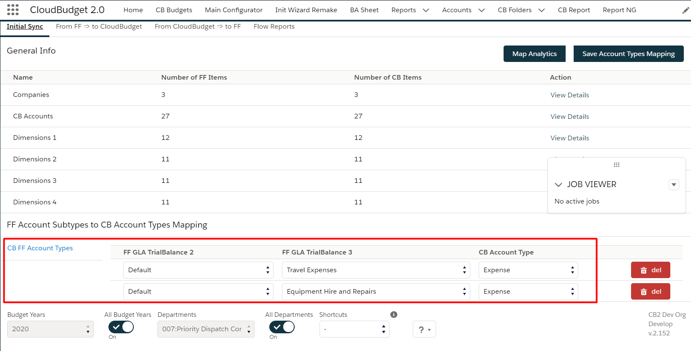

<html>
<body>

<head>
    <meta charset="UTF-8">
    <title>CloudBudget2.0 Release Note</title>
</head>

<h1 id='pageTop'>CloudBudget2.0 Summer 2020 Release Note</h1>

    
List of Summer 2020 additives

    <ul>
        <li><a href="ReleaseNote.html#budgetApp">Budget Application</a></li>
        <li><a href="ReleaseNote.html#budgetAppSheet">Budget App Sheet</a></li>
        <li><a href="ReleaseNote.html#googleDrive">Google Drive Integration</a></li>
        <li><a href="ReleaseNote.html#postingRules">Posting Rules</a></li>
        <li><a href="ReleaseNote.html#CBalances">CBalances</a></li>
        <li><a href="ReleaseNote.html#CBReports">CB Reports</a></li>
        <li><a href="ReleaseNote.html#reportConfigurator">Report Configurator</a></li>
        <li><a href="ReleaseNote.html#FFIntegration">FF Integration</a></li>
        <li><a href="ReleaseNote.html#other">Other</a></li>
    </ul>
    
You can find additional information for each item below.

     
    

     
    <h3 id='budgetApp'>Budget App</h3>
    <ul>
        <li>Autocomplete panel allows to quickly capture values through the year</li>
        <li>Budget import from Excel captures now formula results</li>
        <li>Advanced capabilities of Calculation Rules (scenarios included, general enhancements)</li>
        <li>Currency component allows to plan and capture actuals in local currencies</li>
        <li>Budget lines modes added: Employee/Rate & Price/Quantity are now there in addition to just amounts</li>
    </ul>
    
       

    <h3 id='budgetAppSheet'>Budget App Sheet</h3>
    <ul>
        <li>Grouping by Accounts, SubAccounts, client analytics with and without Budget Apps</li>
        <li>Additional comprehensive Budget view added</li>
        <li>New Excel export format (each Budget App on its own sheet)</li>
    </ul>
    
       

    <h3 id='googleDrive'>Google Drive Integration</h3>
    <ul>
        <li>Each user is able to connect using different Google Drive accounts</li>
        <li>Connecting with Google Drive using Named Credentials</li>
        <li>Export/import of Budgets to/from Google Drive without using Excel</li>
        <li>Uploading, downloading and deleting files to/from connected Google Drive</li>
    </ul>
       

    <h3 id='postingRules'>Posting Rules</h3>
    <ul>
        <li>Forecasted Cash Flow postings templates</li>
        <li>Ability to post/unpost selected rules</li>
        <li>Calculation Rules integrated</li>
        <li>Hints, validations and tools to simplify setup</li>
    </ul>
       

    <h3 id='CBalances'>CBalances (summaries data records used for reporting)</h3>
    <ul>
        <li>Advanced capabilities for customizing fields</li>
        <li>Ability to run batches of selected CBalance Rules</li>
        <li>Additional information about the number and created date of CBalances</li>
    </ul>
    
       

    <h3 id='CBReports'>CB Reports</h3>
    <ul>
        <li>New optimized report engine</li>
        <li>Report export to Excel & PDF</li>
        <li>Reports are structured by folders</li>
        <li>Report values may depend on the user's local currency values</li>
    </ul>
    
    
       

    <h3 id='reportConfigurator'>CB Report Configurator</h3>
    <ul>
        <li>New convenient and clear layout</li>
        <li>"Quick" mode for Reports</li>
        <li>Column generator</li>
        <li>Validation and minor improvements</li>
    </ul>
    
       

    <h3 id='FFIntegration'>FF Integration</h3>
    <ul>
        <li>Mapping analytics</li>
        <li>Import status report</li>
        <li>Validations and minor improvements</li>
    </ul>
    
    
       

    <h3 id='other'>Other</h3>
    <ul>
        <li>Org customization and transfer using an Excel file</li>
        <li>Ability to make the Primary Document fields required or disabled</li>
        <li>New Tag Set layout</li>
        <li>Customizable Panel to run bundles of the batches to simplify the workflow and data update</li>
    </ul>
       

 

 

<!--

    Navigate to:
    
<a href="https://cloudbudgetinc.github.io/Docs/CBCore">CB Base Documentation</a>

-->

<button onclick="topFunction()" id="myBtn" title="Go to top">Top</button>

</body>
</html>