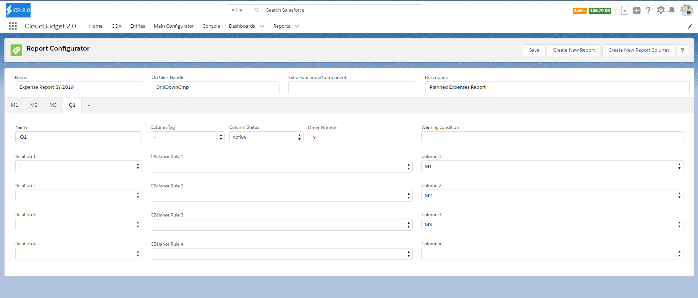

<html>
<body>
<h1>Report</h1>

 
Report Features

 
 
    

 

<a href="https://fallentol.github.io/CloudBudget/CB2/ReportColumn">Columns</a>

<a href="https://fallentol.github.io/CloudBudget/CB2/ReportConfigurator">Report Configurator</a>

    
</body>
</html>